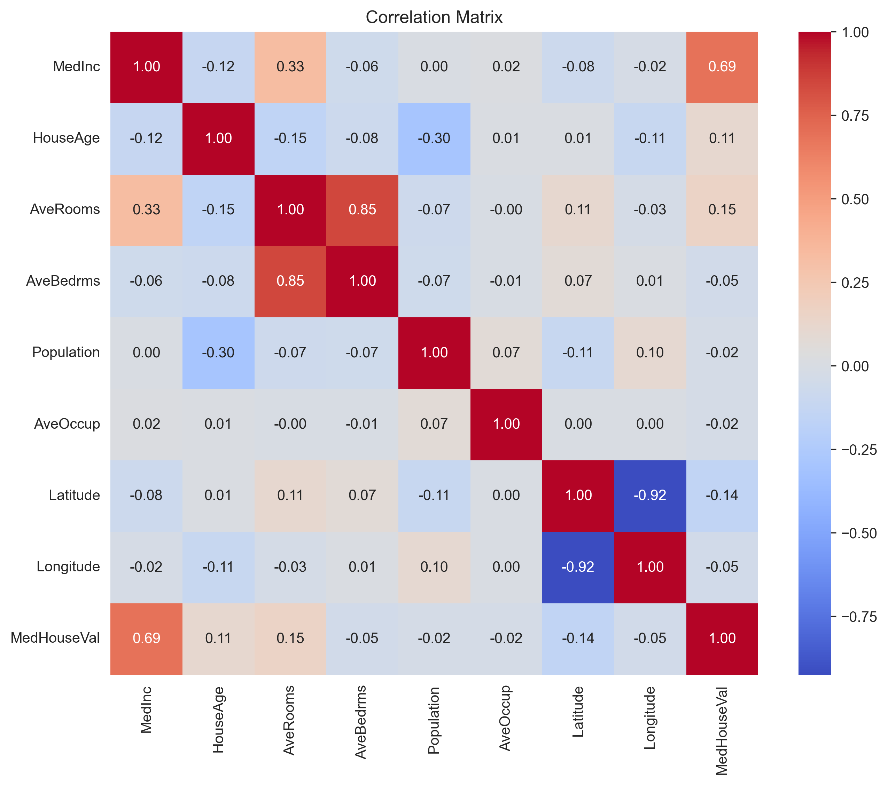
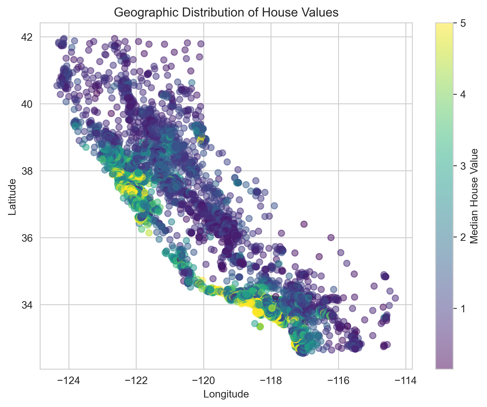
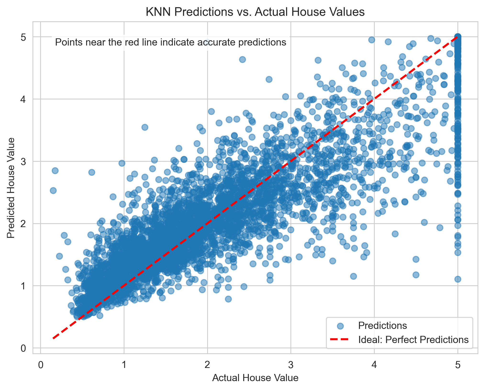
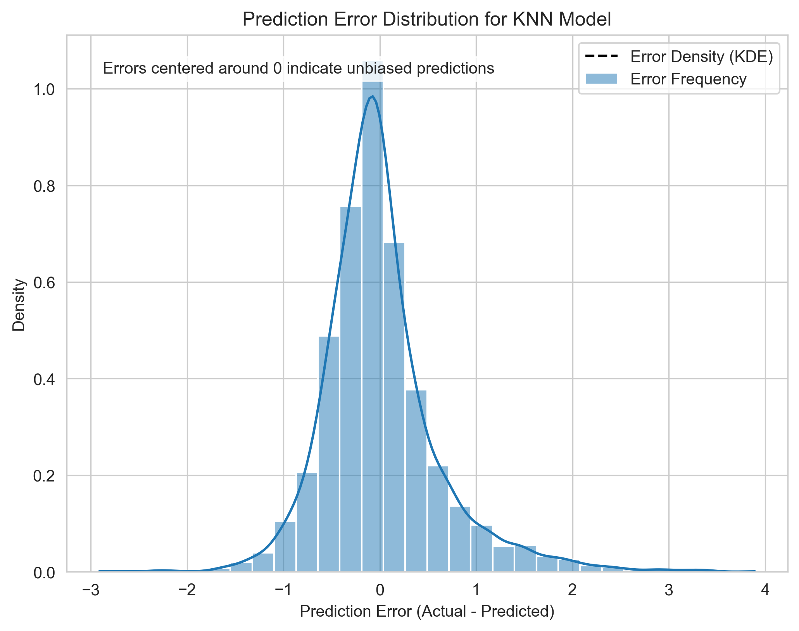

# KNN Regression: California Housing Prices

A portfolio project showcasing K Nearest Neighbor (KNN) regression using Scikit-learn to predict house prices in California. This project demonstrates advanced machine learning techniques, including feature engineering, pipeline automation, hyperparameter tuning, and model evaluation, with engaging visualizations.

## Overview
This project uses the [California Housing Prices dataset](https://scikit-learn.org/stable/datasets/real_world.html#california-housing-dataset) (~20,640 samples, 8 features) to predict median house values based on features like median income, house age, and geographic location. The workflow includes:
- **Exploratory Data Analysis (EDA)**: Summarized features, identified outliers, and visualized correlations.
- **Preprocessing**: Handled outliers, scaled features, and created a pipeline for reproducibility.
- **Feature Engineering**: Added polynomial features and Haversine distance to San Francisco.
- **Modeling**: Trained a KNN regression model, optimized hyperparameters with GridSearchCV.
- **Evaluation**: Assessed performance using RMSE, MAE, and R², with visualizations of predictions.

## Project Structure
- `data/`: Placeholder for dataset (fetched via Scikit-learn).
- `notebooks/knn_housing.ipynb`: Jupyter Notebook with all code (EDA, preprocessing, modeling, evaluation).
- `images/`: Static visualizations for documentation.
- `requirements.txt`: Python dependencies.

## Key Visualizations
### Feature Correlations

Shows relationships between features (e.g., strong correlation between median income and house value).

### Geographic Distribution

Visualizes house values by location, highlighting high-value coastal areas.

### Predicted vs. Actual House Values

Compares KNN predictions to actual values.

### Prediction Error Distribution

Shows the distribution of prediction errors.

## Results
- **Baseline KNN** (*k*=5): Test RMSE 0.6274, R² 0.6996.
- **Optimized KNN**: Improved test R² 0.7167 via GridSearchCV (*k*=15, distance weights).
- Key predictors: Median income, Haversine distance to San Francisco.

## Installation
1. Clone the repository:
   ```bash
   git clone https://github.com/your-username/knn-housing-regression.git
   cd knn-housing-regression

2. Create a virtual environment and install dependencies:
   ```bash
   python -m venv venv
   source venv/bin/activate  # On Windows: venv\Scripts\activate
   pip install -r requirements.txt

3. Run the notebook:
   ```bash
   jupyter notebook notebooks/knn_housing.ipynb

## License
MIT License

## Contact
Max Goudy

- www.linkedin.com/in/goudymt
- goudymt@gmail.com